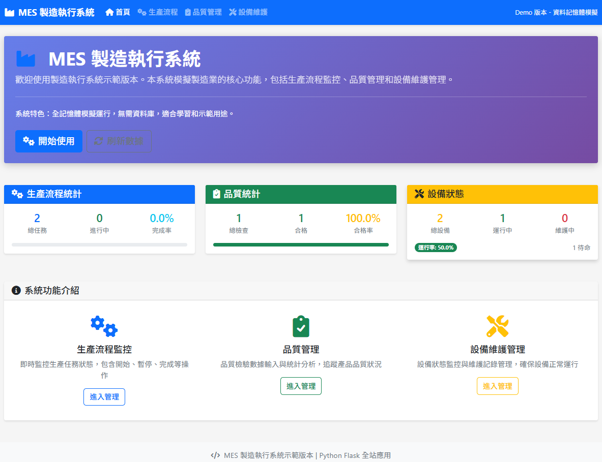

# MES 製造執行系統示範版本

一個基於 Python Flask 的完整 MES（製造執行系統）示範網站，模擬製造業的核心功能，包括生產流程監控、品質管理和設備維護管理。



## 🚀 功能特色

### 📊 生產流程監控
- 即時生產任務狀態追蹤
- 任務開始、暫停、繼續、完成操作
- 生產進度可視化顯示
- 生產統計報表

### ✅ 品質管理
- 品質檢驗記錄輸入
- 缺陷分類統計
- 合格率趨勢分析
- 品質報表生成

### 🔧 設備維護管理
- 設備狀態即時監控
- 維護記錄管理
- 設備利用率分析
- 維護提醒功能

## 🛠 技術架構

### 後端技術
- **Python Flask** - Web 框架
- **Jinja2** - 模板引擎
- **記憶體模擬** - 資料存儲（無需資料庫）

### 前端技術
- **HTML5** - 語義化標記
- **CSS3** - 響應式設計
- **JavaScript (ES6+)** - 互動功能
- **Bootstrap 5** - UI 框架
- **Chart.js** - 圖表展示
- **Font Awesome** - 圖標庫

## 📁 專案結構

```
VibeCodingMES/
├── app.py                 # Flask 主應用
├── requirements.txt       # 依賴套件
├── PRD.md                # 產品需求文件
├── README.md             # 專案說明
├── templates/            # HTML 模板
│   ├── base.html        # 基礎模板
│   ├── index.html       # 首頁
│   ├── production.html  # 生產流程頁面
│   ├── quality.html     # 品質管理頁面
│   └── equipment.html   # 設備維護頁面
└── static/              # 靜態資源
    ├── css/
    │   └── style.css    # 自定義樣式
    └── js/
        └── main.js      # JavaScript 功能
```

## 🚀 快速開始

### 1. 環境準備
```bash
.\.venv\Scripts\Activate.ps1

# 確保已安裝 Python 3.7+
python --version

# 克隆專案
git clone <repository-url>
cd VibeCodingMES
```

### 2. 安裝依賴
```bash
pip install -r requirements.txt
```

### 3. 運行應用
```bash
python app.py
```

### 4. 訪問系統
打開瀏覽器訪問：`http://localhost:5000`

## 📱 使用說明

### 首頁
- 查看系統概覽和統計數據
- 導航到各功能模組
- 即時數據刷新

### 生產流程監控
1. 查看生產任務列表
2. 點擊按鈕控制任務狀態：
   - **開始** - 啟動生產任務
   - **暫停** - 暫停進行中的任務
   - **繼續** - 恢復暫停的任務
   - **完成** - 標記任務完成
   - **重置** - 重置任務狀態
3. 查看即時統計數據

### 品質管理
1. 填寫品檢記錄表單
2. 選擇檢驗結果和缺陷類型
3. 查看品質統計和趨勢圖表
4. 瀏覽歷史記錄

### 設備維護管理
1. 查看設備狀態概覽
2. 點擊按鈕更新設備狀態：
   - **開始維護** - 將設備設為維護狀態
   - **恢復運行** - 將設備設為運行狀態
   - **設為待命** - 將設備設為待命狀態
3. 查看維護統計和利用率分析

## 🎨 設計特色

### 響應式設計
- 支援桌面、平板、手機等設備
- Bootstrap 5 網格系統
- 移動端優化體驗

### 現代化 UI
- 乾淨簡潔的介面設計
- 直觀的操作流程
- 豐富的視覺回饋

### 即時互動
- AJAX 無刷新操作
- 即時數據更新
- 動態圖表展示

## 🔧 客製化配置

### 修改模擬資料
編輯 `app.py` 中的 `MESData` 類別：

```python
class MESData:
    def __init__(self):
        # 修改初始資料
        self.production_tasks = [...]
        self.quality_records = [...]
        self.equipment_list = [...]
```

### 自訂樣式
修改 `static/css/style.css`：

```css
:root {
    --primary-color: #your-color;
    --success-color: #your-color;
    /* 其他變數 */
}
```

### 添加新功能
1. 在 `app.py` 中添加新路由
2. 創建對應的模板文件
3. 更新導航欄選單

## 📊 系統特色

### 記憶體模擬
- 所有資料存儲在記憶體中
- 無需資料庫配置
- 快速啟動和測試

### 即時更新
- 30秒自動刷新機制
- 手動刷新功能
- 頁面可見性優化

### 錯誤處理
- 完整的錯誤處理機制
- 用戶友好的錯誤提示
- 系統穩定性保障

## 🤝 貢獻指南

1. Fork 此專案
2. 創建功能分支 (`git checkout -b feature/AmazingFeature`)
3. 提交更改 (`git commit -m 'Add some AmazingFeature'`)
4. 推送分支 (`git push origin feature/AmazingFeature`)
5. 開啟 Pull Request

## 📝 授權

本專案採用 MIT 授權條款 - 詳見 [LICENSE](LICENSE) 文件

## 📞 聯絡資訊

如有問題或建議，請透過以下方式聯絡：

- 電子郵件：your-email@example.com
- GitHub Issues：[建立新問題](https://github.com/your-username/VibeCodingMES/issues)

## 🙏 致謝

感謝所有為此專案做出貢獻的開發者和使用者！

---

**注意**：這是一個示範版本，專為學習和展示目的設計。生產環境中請使用真實的資料庫和更完善的架構。
